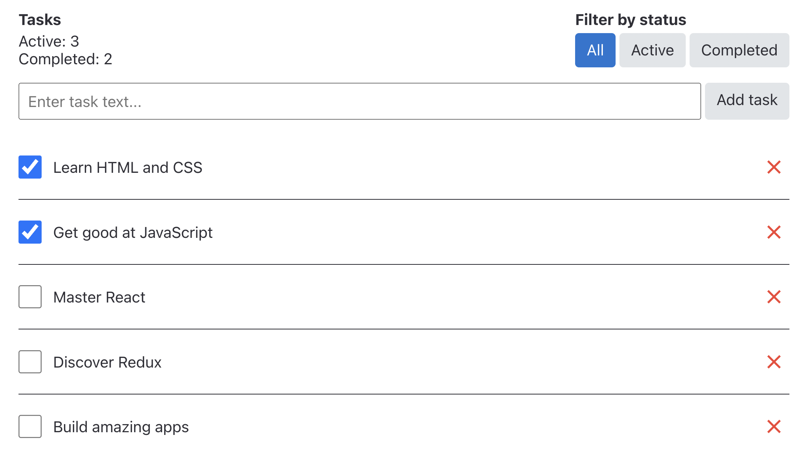

# Планувальник завдань

Ванільний Redux на прикладі програми планувальника завдань, в якій можна створити, видалити, відзначити завдання як виконане і відфільтрувати задачі за статусом.

## Базові вимоги до інтерфейсу та логіки роботи програми:

- Інтерфейс повинен складатися з кількох частин:
  - Шапка з інформацією про завдання та фільтри
  - Форма з полем введення для створення нових завдань
  - Список завдань
- У шапці необхідно відображати:
  - Кількість виконаних та невиконаних завдань
  - Фільтри списку завдань зі значеннями «All», «Active» та «Completed»
- У кожного елементу списку завдань має бути:
  - Абзац з текстом який вводив у форму користувач під час створення завдання
  - Чекбокс перемикання статусу «виконано»
  - Кнопка видалення завдання

Кінцева мета - додаток, інтерфейс якого виглядатиме так:

